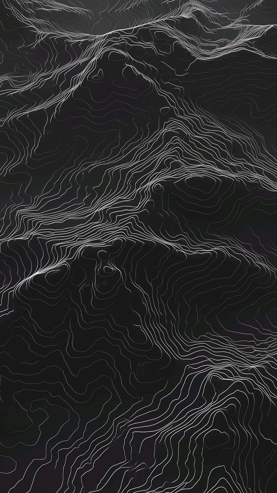

    

  <samp>
    hey, 
     
    about me: 
    - brazilian, pt-br + en-us 
    - software engineering student 
    - working as IT engineering intern 
    - web/mobile developer, also working in UI/UX design 
    - enjoy researching networks (vms, linux server) 
      
    langs && frameworks: 
    > javascript, next, node, react, react native, typescript 
      
    os: 
    > some gnome-based distro (actually debian), windows 
      
    tools: 
    - <a href="https://developer.android.com/?hl=pt-br">android studio</a> - android emulator 
    - <a href="https://www.figma.com/">figma</a> - ui/ux design 
      
    blog: 
    coming soon
  </samp>

